# Hi 👋, I'm Stelian

## Personal Details

- 🔭 I'm currently working on improving my programming skills and learning new technologies.
- 🌱 I'm currently learning about databases, API design, and cloud fundamentals.
- 🏆 Participating in **hackathons** and coding competitions
- 💬 Ask me about what's new in tech
- 🏓 Fun fact: I might be better at table tennis than you 😅
- 📫 How to reach me: [andrei04pungaru@gmail.com](mailto:andrei04pungaru@gmail.com)

## Technical Expertise

  
  
  
  
  
  
  

## Github Status

